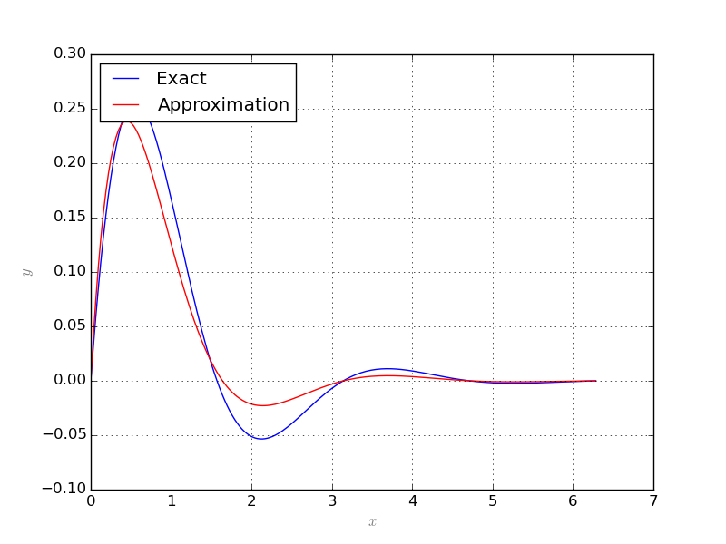
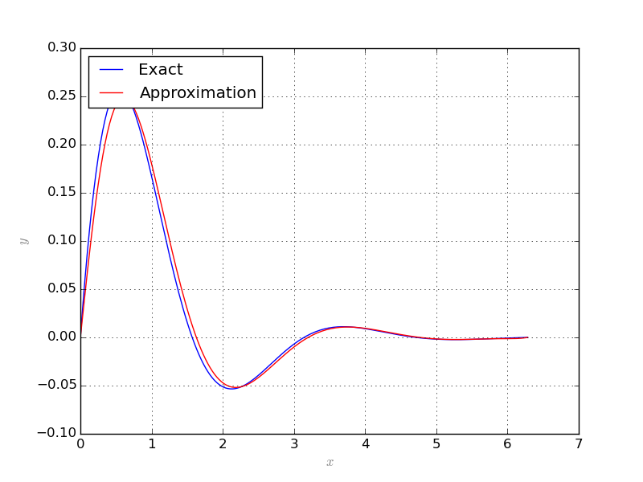
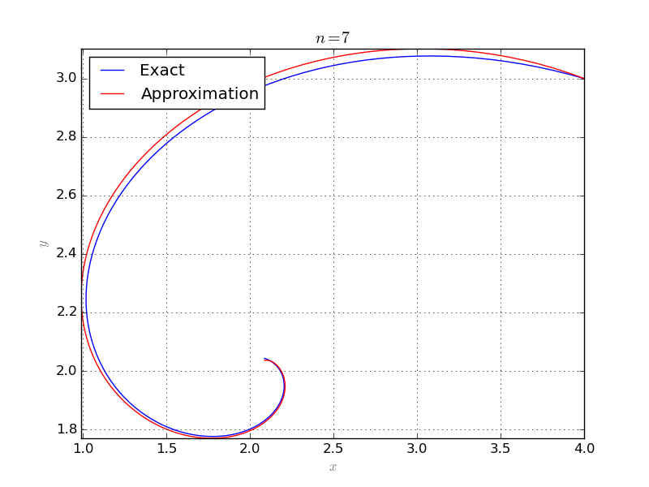
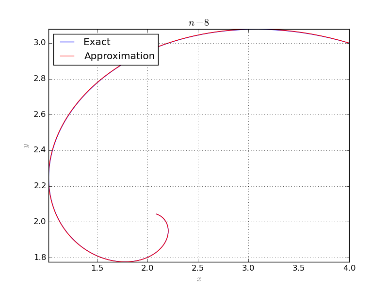

=========================
Collocation
=========================

Integro-differential equations
===============================

A system of integro-differential equations is a system of equations that involve both integrals and derivatives of a function.
The general first-order, linear (only with respect to the term involving derivative) integro-differential equation is of the form

.. math::
	\frac{d}{dx}u(x) + \int_{x_0}^{x} f(t, u(t)) dt = g(x, u(x)),\quad u(x_0)=u_0.

Collocation method
=======================

In collocation method, one assumes that the solution of the equation is of a certain form and tries to exploit information about
the assumed solution.
More specifically, assume that :math:`u_1, u_2, \dots, u_n` are orthonormal functions and the solution is of the form :math:`f=\sum_i a_i u_i`
where :math:`a_i` are unknowns. 
Plug `f` in to the equation and choose `n` different admissible points. plug those points in to the resulting equation to elliminate `x`.
Then we obtain `n` equations in terms of :math:`a_1,\dots, a_n`. Solving the resulted system of algebraic equations gives an approximation for `f`.

Collocation class
========================

Single equation
---------------------

The ``Collocation`` class implements the above described method. The follwing example solves the equation
:math:`\frac{dy}{dx} + 2y + 5 \int y dx = 1`, :math:`y(0)=y(2\pi)=0` where the exact solution is :math:`\frac{1}{2}\sin(2x)e^{-x}`::

	from sympy import *
	from pyProximation import *
	# symbolic variable
	x = Symbol('x')
	# symbolic function
	y = Function('y')(x)
	# number of approximation terms
	n = 10
	# orthogonal system
	S = OrthSystem([x], [(0, 2*pi)])
	# polynomial basis
	B = S.PolyBasis(n)
	# link the basis to the orthogonal system
	S.Basis(B)
	# form the orthonormal basis
	S.FormBasis()
	# form the equation
	EQ = Eq(diff(y, x) + 2*y +5*integrate(y, x), 1)
	# initiate collocation object with x as variable and y as function
	C = Collocation([x], [y])
	# link the orthogonal system to the collocation object
	C.SetOrthSys(S)
	# link the equation to the collocation object
	C.Equation([EQ])
	# initial and boundary conditions
	C.Condition(Eq(y, 0), [0])
	C.Condition(Eq(y, 0), [2*pi])
	# set the solver to 'scipy'
	C.setSolver('scipy')
	# solve to collocation system and print the solution
	Apprx = C.Solve()
	print Apprx[0]

In the above example the ``Collocation`` class selects collocation points itself according to the measure choosen for orthogonal system, in this case,
the usual Lebesgue measure. Thus, the class samples enough number of points uniformly from the domain. The solution and the exact answer are depicted 
below:

One can provide prefered collocation points to the solver. The following repeats the previous example where collocation points are selected in a way from
the domain within a fix distance from each other::

	from sympy import *
	from pyProximation import *
	# symbolic variable
	x = Symbol('x')
	# symbolic function
	y = Function('y')(x)
	# number of approximation terms
	n = 10
	# orthogonal system
	S = OrthSystem([x], [(0, 2*pi)])
	# polynomial basis
	B = S.PolyBasis(n)
	# link the basis to the orthogonal system
	S.Basis(B)
	# form the orthonormal basis
	S.FormBasis()
	# form the equation
	EQ = Eq(diff(y, x) + 2*y +5*integrate(y, x), 1)
	# initiate collocation object with x as variable and y as function
	C = Collocation([x], [y])
	# link the orthogonal system to the collocation object
	C.SetOrthSys(S)
	# link the equation to the collocation object
	C.Equation([EQ])
	# initial and boundary conditions
	C.Condition(Eq(y, 0), [0])
	C.Condition(Eq(y, 0), [2*pi])
	# a list of collocation points
	pnts = [[i*2*pi/n] for i in range(1,n)]
	# link the collocation point to the object
	C.CollPoints(pnts)
	# set the solver to 'scipy'
	C.setSolver('scipy')
	# solve to collocation system and print the solution
	Apprx = C.Solve()
	print Apprx[0]

The result shows slight improvment in the solution:

.. note::
	Each point of collocation must be given as a *list* or *tuple*.

System of equations
-------------------------
.. _ParamPlotExm:

The ``Collocation`` class is also able to handel systems of equations. Consider the following system of partial differential equations:

.. math::
	\left\lbrace
	\begin{array}{lcl}
		\frac{\partial x}{\partial t} + x + 4y & = & 10\\
		x - \frac{\partial y}{\partial t} - y & = & 0,
	\end{array}\right.

with initial conditions :math:`x(0) = 4` and :math:`y(0) = 3`. The exact solution to the above system is: 

.. math::
	\begin{array}{lcl}
		x(t) & = & 2(1 + e^{-t}\cos(2t) - e^{-t}\sin(2t))\\
		y(t) & = & 2 + e^{-t}\cos(2t) + e^{-t}\sin(2t)
	\end{array}

The following code solves the system and plots the exact and approximate solutions::

	from sympy import *
	from pyProximation import *
	# symbolic variable
	t = Symbol('t')
	# symbolic function
	x = Function('x')(t)
	y = Function('y')(t)
	# number of approximation terms
	n = 8
	# orthogonal system
	S = OrthSystem([t], [(0, pi)])
	# polynomial basis
	B = S.PolyBasis(n)
	# link the basis to the orthogonal system
	S.Basis(B)
	# form the orthonormal basis
	S.FormBasis()
	# form the equation
	EQ1 = Eq(diff(x, t) + x + 4*y, 10)
	EQ2 = Eq(x - diff(y, t) - y, 0)
	# initiate collocation object with x as variable and y as function
	C = Collocation([t], [x, y])
	# link the orthogonal system to the collocation object
	C.SetOrthSys(S)
	# link the equation to the collocation object
	C.Equation([EQ1, EQ2])
	# initial and boundary conditions
	C.Condition(Eq(x, 4), [0])
	C.Condition(Eq(y, 3), [0])
	# set the solver to 'scipy'
	C.setSolver('scipy')
	# solve to collocation system and print the solution
	Apprx = C.Solve()
	# print the answeres
	print Apprx[0]
	print Apprx[1]
	# the exact solution
	f = [2*(1 + exp(-t)*cos(2*t) - exp(-t)*sin(2*t)), 2 + exp(-t)*cos(2*t) + exp(-t)*sin(2*t)]
	# plot the exact and approximate solutions
	G = Graphics('sympy', numpoints=200)
	G.SetTitle("$n = %d$"%(n))
	G.ParamPlot2D(f, (t, 0, pi), color='blue', legend='Exact')
	G.ParamPlot2D(Apprx, (t, 0, pi), color='red', legend='Approximation')
	G.save('Plot-%d.png'%(n))

The followings are results for :math:`n=7` and :math:`n=8`:

