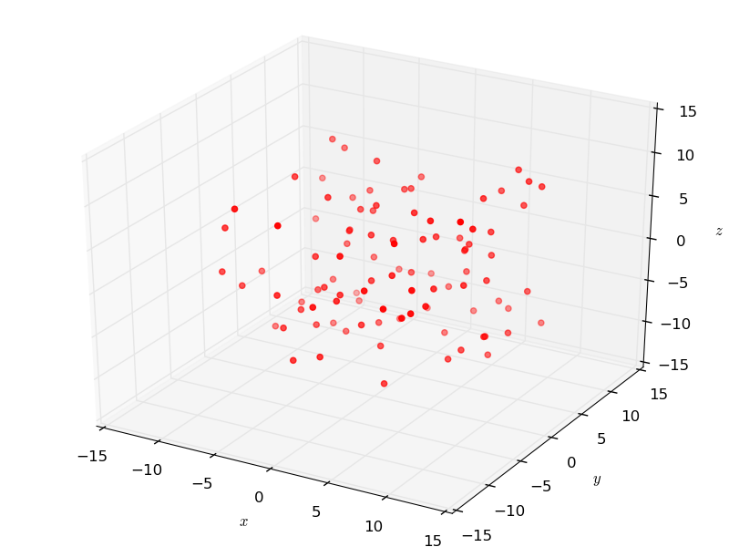
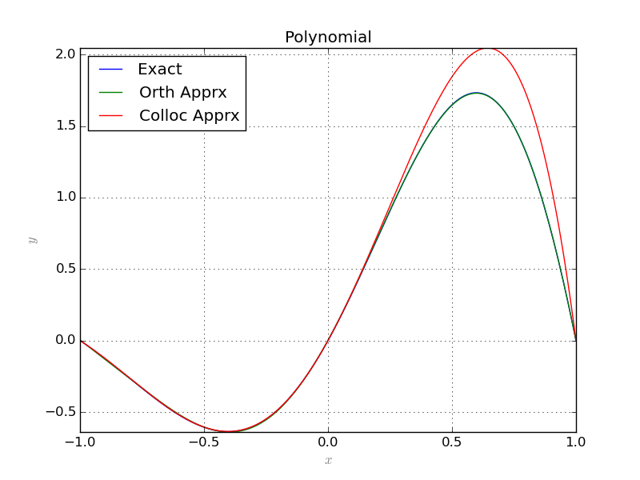
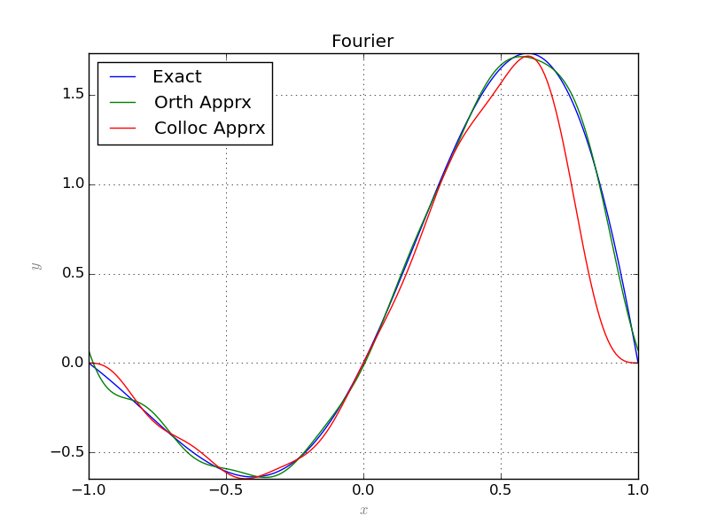
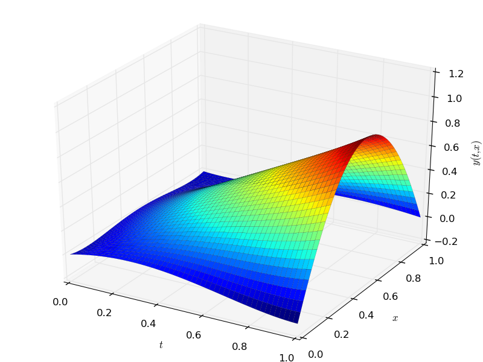
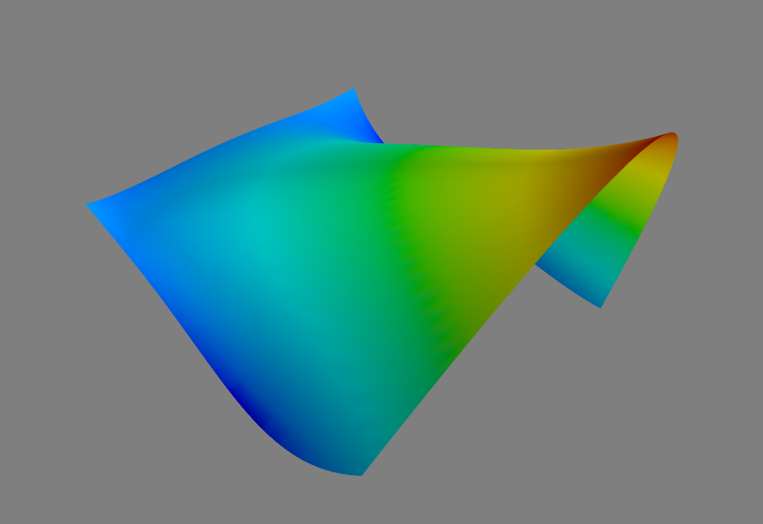

=====================
Graphics
=====================

This small module provides simple functionality to draw 2D and 3D plots.
Since the functions that appear in this package are of three different types, it must be declared to the ``Graphic`` class, what type of function
it is dealing with. The three different types are:

	1. ``numeric``, the default type,
	2. ``sympy``, the symbolic **sympy** functions,
	3. ``sage``, the symbolic **sage** functions

The following plots a list of random points in 3D::

	from random import uniform
	# import the module
	from pyProximation import Graphics
	# list of random points
	points = [(uniform(-10, 10), uniform(-10, 10), uniform(-10, 10)) for _ in range(100)]
	# the graphic object
	G = Graphics()
	# link the points to the object
	G.Point(points, color='red')
	# save to file
	G.save('points.png')

Two Dimensional Plots
=========================

The method ``Plot2D`` is to plot curves in 2 dimensions.
The following code shows an example::

	# chOose the symbolic environment
	Symbolic = 'sympy'
	# define the symbolic variables accordingly
	if Symbolic == 'sympy':
		from sympy import *
		x = Symbol('x')
		y = Function('y')(x)
	elif Symbolic == 'sage':
		from sage.all import *
		x = var('x')
		y = function('y')(x)
	# import the modules
	from pyProximation import *
	# size of basis
	n = 6
	# set the measure
	M = Measure([(-1, 1)], lambda x:1./sqrt(1.-x**2))
	# Orthogonal system of functions
	S = OrthSystem([x], [(-1, 1)], Symbolic)
	# link the measure to the orthogonal system
	S.SetMeasure(M)
	# monomial basis
	B = S.PolyBasis(n)
	# Fourier basis
	#B = S.FourierBasis(n)
	# link the basis
	S.Basis(B)
	# form the orthogonal system
	S.FormBasis()
	# the exact solution
	Z = sin(pi*x)*exp(x)
	R = diff(Z, x, x) - diff(Z, x)
	# the pde
	if Symbolic == 'sympy':
		EQ1 = (Eq(diff(y, x, x) - diff(y, x), R))
	elif Symbolic == 'sage':
		EQ1 = (diff(y, x, x) - diff(y, x) == R)
	# corresponding coefficients
	series = S.Series(Z)
	# orthogonal approximation
	ChAprx = sum([S.OrthBase[i]*series[i] for i in range(m)])
	# set up the collocation class
	C = Collocation([x], [y], Symbolic)
	# link to the orthogonal system
	C.SetOrthSys(S)
	# link the equation
	C.Equation([EQ1])
	# initial conditions
	if Symbolic == 'sympy':
		C.Condition(Eq(y, 0), [0])
		C.Condition(Eq(y, sin(-pi)*exp(-1)), [-1])
		C.Condition(Eq(y, sin(pi)*exp(1)), [1])
	elif Symbolic == 'sage':
		C.Condition(y == 0, [0])
		C.Condition(y == sin(-pi)*exp(-1), [-1])
		C.Condition(y == sin(pi)*exp(1), [1])
	# collocation points
	m = len(S.OrthBase)
	pnts = [[-1 + i*2./m] for i in range(m)]
	# link the collocation points
	C.CollPoints(pnts)
	# set solver
	C.setSolver('scipy')
	# solve
	Apprx = C.Solve()
	print Apprx[0]
	# plot the results
	G = Graphics(Symbolic)
	G.Plot2D(Z, (x, -1, 1), color='blue', legend='Exact')
	G.Plot2D(ChAprx, (x, -1, 1), color='green', legend='Orth Apprx')
	G.Plot2D(Apprx[0], (x, -1, 1), color='red', legend='Colloc Apprx')
	G.save('PlotsPoly.png'%(n))
	#G.save('PlotsFourier.png'%(n))

For an example of parametric plots see :ref:`this <ParamPlotExm>`.

Three Dimensional Plots
=========================

To generate static 3 dimensional plots, ``Graphics`` implement ``Plot3D``.
The following example illustrates the usage of this method::

	# select the symbolic tool
	Symbolic = 'sympy'
	if Symbolic == 'sympy':
		from sympy import *
		x = Symbol('x')
		t = Symbol('t')
		y = Function('y')(t, x)
	elif Symbolic == 'sage':
		from sage.all import *
		t = var('t')
		x = var('x')
		y = function('y')(t, x)
	# import the modules
	from pyProximation import *
	# degree of basis
	n = 4
	# orthogonal system
	S = OrthSystem([t, x], [(0, 1), (0, 1)])
	# monomial basis
	B = S.PolyBasis(n)
	# link the basis
	S.Basis(B)
	# form the orthonormal basis
	S.FormBasis()
	# construct a pde
	Z = t*sin(pi*x)
	R = diff(Z, t) - diff(Z, x)
	if Symbolic == 'sympy':
		EQ1 = Eq(diff(y, t) - diff(y, x), R)
	elif Symbolic == 'sage':
		EQ1 = diff(y, t) - diff(y, x) == R
	# collocation object
	C = Collocation([t, x], [y])
	# link the orthogonal system
	C.SetOrthSys(S)
	# link the equation
	C.Equation([EQ1])
	# some initial & boundary conditions
	if Symbolic == 'sympy':
		C.Condition(Eq(y, 0), [0, 0])
		C.Condition(Eq(y, 0), [0, .3])
		C.Condition(Eq(y, 0), [1, 1])
		C.Condition(Eq(y, 1), [1, .5])
		C.Condition(Eq(y, 0), [0, .7])
	elif Symbolic == 'sage':
		C.Condition(y == 0, [0, 0])
		C.Condition(y == 0, [0, .3])
		C.Condition(y == 0, [1, 1])
		C.Condition(y == 1, [1, .5])
		C.Condition(y == 0, [0, .7])
	# set the solver
	C.setSolver('scipy')
	# solve the collocation system
	Apprx = C.Solve()
	print Apprx[0]
	# plot the result
	G = Graphics(Symbolic)
	G.SetLabelX("$t$")
	G.SetLabelY("$x$")
	G.SetLabelZ("$y(t, x)$")
	G.Plot3D(Apprx[0], (t, 0, 1), (x, 0, 1))
	# save the image
	G.save('PDEplot.png'%(n))
	# open the interactive window
	G.interact()

A second method called ``interact`` is invoked at the end which called the ``mayavi`` library to show an interactive view of the surface.

