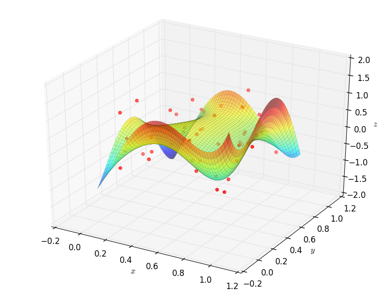
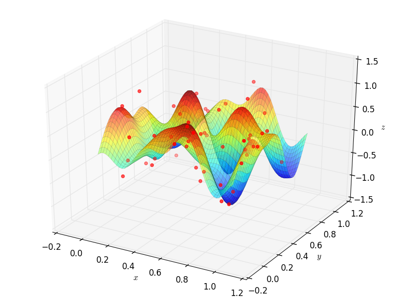
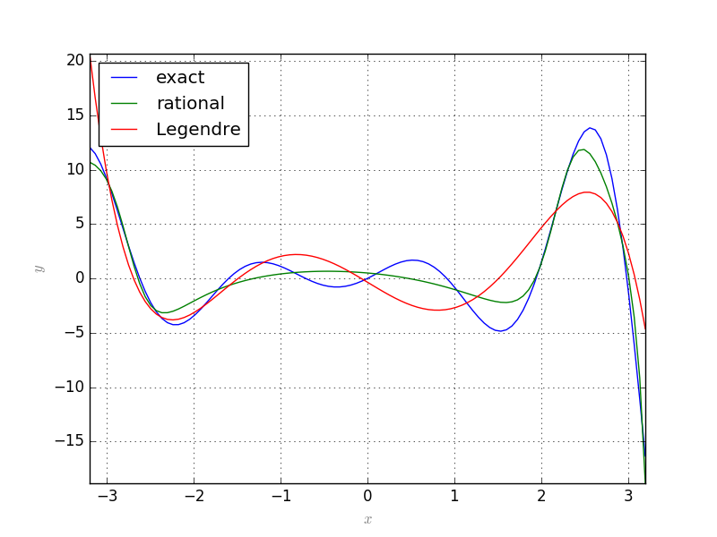

=========================
Hilbert Spaces
=========================

Orthonormal system of functions
===============================

Let `X` be a topological space and :math:`\mu` be a finite Borel measure on `X`. The bilinear function :math:`\langle\cdot,\cdot\rangle` defined
on :math:`L^2(X, \mu)` as :math:`\langle f, g\rangle = \int_X fg d\mu` is an inner product which turns :math:`L^2(X, \mu)` into a Hilbert space.

Let us denote the family of all continuous real valued functions on a non-empty compact space `X` by :math:`\textrm{C}(X)`. Suppose that among elements 
of :math:`\textrm{C}(X)`, a subfamily `A` of functions are of particular interest. 
Suppose that `A` is a subalgebra of :math:`\textrm{C}(X)` containing constants.
We say that an element :math:`f\in\textrm{C}(X)` can be approximated by elements of `A`, if for every :math:`\epsilon>0`, there exists 
:math:`p\in A` such that :math:`|f(x)-p(x)|<\epsilon` for every :math:`x\in X`. 
The following classical results guarantees when every :math:`f\in\textrm{C}(X)` can be approximated by elements of `A`.

.. note::
	**Stone-Weierstrass:** 

	Every element of :math:`\textrm{C}(X)` can be approximated by elements of `A` if and only if for every :math:`x\neq y\in X`, 
	there exists :math:`p\in A` such that :math:`p(x)\neq p(y)`.

Despite the strong and important implications of the Stone-Weierstrass theorem, it leaves every computational details out and does not give an
specific algorithm to produce an estimator for `f` with elements of `A`, given an error tolerance :math:`\epsilon`, and the search for a such begins.

Define :math:`\|f\|_{\infty}` (the :math:`\sup` norm of `f`) of a given function :math:`f\in\textrm{C}(X)` by

.. math::
	\|f\|_{\infty} = \sup_{x\in X}|f(x)|,

Then the above argument can be read as: 
For every :math:`f\in\textrm{C}(X)` and every :math:`\epsilon>0`, there exists :math:`p\in A` such that :math:`\|f-p\|_{\infty}<\epsilon`.

Let :math:`(V, \langle\cdot,\cdot\rangle)` be an inner product space with :math:`\|v\|_2=\langle v,v\rangle^{\frac{1}{2}}`. 
A basis :math:`\{v_{\alpha}\}_{\alpha\in I}` is called an orthonormal basis for `V` if :math:`\langle v_{\alpha},v_{\beta}\rangle=\delta_{\alpha\beta}`, 
where :math:`\delta_{\alpha\beta}=1` if and only if :math:`\alpha=\beta` and is equal to `0` otherwise. 
Every given set of linearly independent vectors can be turned into a set of orthonormal vectors that spans the same sub vector space
as the original. The following well-known result gives an algorithm for producing such orthonormal from a set of linearly independent vectors:

.. note::
	**Gram--Schmidt**

	Let :math:`(V,\langle\cdot,\cdot\rangle)` be an inner product space. Suppose :math:`\{v_{i}\}^{n}_{i=1}` is a set of linearly independent vectors in `V`. 
	Let

	.. math::
		u_{1}:=\frac{v_{1}}{\|v_{1}\|_2}

	and (inductively) let

	.. math::
		w_{k}:=v_{k}-\sum_{i=1}^{k-1}\langle v_{k},u_{i}\rangle u_{i}\textrm{ and } u_{k}:=\frac{w_{k}}{\|w_{k}\|_2}.

	Then :math:`\{u_{i}\}_{i=1}^{n}` is an orthonormal collection, and for each `k`,

	.. math::
		span\{u_{1},u_{2},\cdots,u_{k}\}=span\{v_{1},v_{2},\cdots,v_{k}\}.

Note that in the above note, we can even assume that :math:`n=\infty`.

Let :math:`B=\{v_1, v_2, \dots\}` be an ordered basis for :math:`(V,\langle\cdot,\cdot\rangle)`. For any given vector :math:`w\in V` and any initial segment 
of `B`, say :math:`B_n=\{v_1,\dots,v_n\}`, there exists a unique :math:`v\in\textrm{span}(B_n)` such that :math:`\|w-v\|_2` is the minimum:

.. note ::
	Let :math:`w\in V` and `B` a finite orthonormal set of vectors (not necessarily a basis). Then for :math:`v=\sum_{u\in B}\langle u,w\rangle u`

	.. math::
		\|w-v\|_2 = \min_{z\in\textrm{span}(B)}\|w-z\|_2.

Now, let :math:`\mu` be a finite measure on `X` and for :math:`f,g\in\textrm{C}(X)` define :math:`\langle f,g\rangle=\int_Xf g d\mu`. 
This defines an inner product on the space of functions. The norm induced by the inner product is denoted by :math:`\|\cdot\|_{2}`. 
It is evident that 

.. math::
	\|f\|_{2}\leq\|f\|_{\infty}\mu(X),~\forall f\in\textrm{C}(X),

which implies that any good approximation in :math:`\|\cdot\|_{\infty}` gives a good :math:`\|\cdot\|_{2}`-approximation. But generally, our interest 
is the other way around. Employing Gram-Schmidt procedure, we can find :math:`\|\cdot\|_{2}` within any desired accuracy, but this does not 
guarantee a good :math:`\|\cdot\|_{\infty}`-approximation. The situation is favorable in finite dimensional case. 
Take :math:`B=\{p_1,\dots,p_n\}\subset\textrm{C}(X)` and :math:`f\in\textrm{C}(X)`, then there exists :math:`K_f>0` such that for every 
:math:`g\in\textrm{span}(B\cup\{f\})`,

.. math::
	K_f\|g\|_{\infty}\leq\|g\|_{2\leq}\|g\|_{\infty}\mu(X).

Since `X` is assumed to be compact, :math:`\textrm{C}(X)` is separable, i.e., :math:`\textrm{C}(X)` admits a countable dimensional dense subvector space
(e.g. polynomials for when `X` is a closed, bounded interval). Thus for every :math:`f\in\textrm{C}(X)` and every :math:`\epsilon>0` one can find a 
big enough finite `B`, such that the above inequality holds. In other words, good enough :math:`\|\cdot\|_{2}`-approximations of `f` give good 
:math:`\|\cdot\|_{\infty}`-approximations, as desired.

OrthSystem
========================

Given a measure space, the ``OrthSystem`` class implements the described procedure, symbolically. Therefore, it relies on a symbolic environment.
Currently, three such environments are acceptable:

	1. `sympy`
	2. `sage`
	3. `symengine`

Legendre polynomials
-----------------------------

Let :math:`d\mu(x) = dx`, the regular Lebesgue measure on :math:`[-1, 1]` and :math:`B=\{1, x, x^2, \dots, x^n\}`. The orthonormal polynomials constructed
from `B` are called *Legendre* polynomials. The :math:`n^{th}` Legendre polynomial is denoted by :math:`P_n(x)`.

The following code generates Legendre polynomials up to a given order::

	# the symbolic package
	from sympy import *
	from pyProximation import Measure, OrthSystem
	# the symbolic variable
	x = Symbol('x')
	# set a limit to the order
	n = 6
	# define the measure
	D = [(-1, 1)]
	M = Measure(D, 1)
	S = OrthSystem([x], D, 'sympy')
	# link the measure to S
	S.SetMeasure(M)
	# set B = {1, x, x^2, ..., x^n}
	B = S.PolyBasis(n)
	# link B to S
	S.Basis(B)
	# generate the orthonormal basis
	S.FormBasis()
	# print the result
	print B.OrthBase

Chebyshev polynomials
----------------------------

Let :math:`d\mu(x)=\frac{dx}{\sqrt{1-x^2}}` on :math:`[-1, 1]` and `B` as in Legendre polynomials. The orthonormal polynomials associated to this setting 
are called *Chebyshev* polynomials and the :math:`n^{th}` one is denoted by :math:`T_n(x)`.

The following code generates Chebyshev polynomials up to a given order::

	# the symbolic package
	from sympy import *
	from numpy import sqrt
	from pyProximation import Measure, OrthSystem
	# the symbolic variable
	x = Symbol('x')
	# set a limit to the order
	n = 6
	# define the measure
	D = [(-1, 1)]
	w = lambda x: 1./sqrt(1. - x**2)
	M = Measure(D, w)
	S = OrthSystem([x], D, 'sympy')
	# link the measure to S
	S.SetMeasure(M)
	# set B = {1, x, x^2, ..., x^n}
	B = S.PolyBasis(n)
	# link B to S
	S.Basis(B)
	# generate the orthonormal basis
	S.FormBasis()
	# print the result
	print S.OrthBase

Approximation
=============================

Let :math:`(X, \mu)` be a compact Borel measure space and :math:`\mathcal{O}=\{u_1, u_2,\dots\}` an orthonormal basis of function whose span is dense in :math:`L^2(X, \mu)`.
Given a function :math:`f\in L^2(X, \mu)`, then `f` can be approximated as

.. math::
	f = \lim\limits_{n\rightarrow\infty}\sum_{i=1}^n\langle f, u_i\rangle u_i

``OrthSystem.Series``  calculates the coefficients :math:`\langle f, u_i\rangle`:

Truncated Fourier series
-----------------------------

Let :math:`d\mu(x) = dx`, the regular Lebesgue measure on :math:`[c, c + 2l]` and :math:`B=\{1, \sin(\pi x), \cos(\pi x), \sin(2\pi x), \cos(2\pi x), 
\dots, \sin(n\pi x), \cos(n\pi x),\}`. 
The following code calculates the Fourier series approximation of :math:`f(x)=\sin(x)e^x`::

	from sympy import *
	from numpy import sqrt
	from pyProximation import Measure, OrthSystem
	# the symbolic variable
	x = Symbol('x')
	# set a limit to the order
	n = 4
	# define the measure
	D = [(-1, 1)]
	w = lambda x: 1./sqrt(1. - x**2)
	M = Measure(D, w)
	S = OrthSystem([x], D, 'sympy')
	# link the measure to S
	S.SetMeasure(M)
	# set B = {1, x, x^2, ..., x^n}
	B = S.FourierBasis(n)
	# link B to S
	S.Basis(B)
	# generate the orthonormal basis
	S.FormBasis()
	# number of elements in the basis
	m = len(S.OrthBase)
	# set f(x) = sin(x)e^x
	f = sin(x)*exp(x)
	# extract the coefficients
	Coeffs = S.Series(f)
	# form the approximation
	f_app = sum([S.OrthBase[i]*Coeffs[i] for i in range(m)])
	print f_app

Fitting Data
-----------------------------

Suppose that a set of data points :math:`(x_1,y_1),\dots,(x_m,y_m)` are given, where :math:`x_i\in\mathbb{R}^n`.
To fit a curve or surface to data with minimum average square error, one can employ ``OrthSystem`` with an arbitrary
system of functions to do so. The following example generates random data and fits two surfaces using polynomials
and trigonometric functions::

	from random import uniform
	from sympy import *
	from sympy.utilities.lambdify import lambdify, implemented_function
	# import the module
	from pyProximation import Measure, OrthSystem, Graphics
	x, y, z = symbols('x, y, z')
	# define dirac function symbolically and numerically
	dirac = implemented_function(
	    Function('dirac'), lambda a, b: 1 * (abs(a - b) < .000001))
	# list of random points
	points = [(uniform(0, 1), uniform(0, 1)) for _ in range(50)]
	# container for the support of discrete measure
	D = {}
	# a symbolic function to represent the random points
	g = 0
	# Random values of the function
	vals = []
	for p in points:
	    t = uniform(-.8, 1)
	    vals.append(t)
	    g += t * dirac(x, p[0]) * dirac(y, p[1])
	    D[p] = 1
	# The discrete measure supported at random points
	M = Measure(D)
	# Orthonormal systems of functions
	S1 = OrthSystem([x, y], [(0, 1), (0, 1)])
	S1.SetMeasure(M)

	S2 = OrthSystem([x, y], [(0, 1), (0, 1)])
	S2.SetMeasure(M)
	# polynomial basis
	B1 = S1.PolyBasis(4)
	# trigonometric basis
	B2 = S2.FourierBasis(3)
	# link the basis to the orthogonal systems
	S1.Basis(B1)
	S2.Basis(B2)
	# form the orthonormal basis
	S1.FormBasis()
	S2.FormBasis()
	# calculate coefficients
	cfs1 = S1.Series(g)
	cfs2 = S2.Series(g)
	# orthogonal approximation
	aprx1 = sum([S1.OrthBase[i] * cfs1[i] for i in range(len(S1.OrthBase))])
	aprx2 = sum([S2.OrthBase[i] * cfs2[i] for i in range(len(S2.OrthBase))])
	# the graphic object
	G1 = Graphics('sympy')
	G2 = Graphics('sympy')
	G1.Plot3D(aprx1, (x, 0, 1), (y, 0, 1))
	G2.Plot3D(aprx2, (x, 0, 1), (y, 0, 1))
	P = []
	idx = 0
	for p in points:
	    q = (p[0], p[1], vals[idx])
	    P.append(q)
	    idx += 1
	# link the points to the object
	G1.Point(P, color='red')
	G2.Point(P, color='red')
	# save to file
	G1.save('poly.png')
	G2.save('trig.png')

Rational Approximation
=============================

Let :math:`f:X\rightarrow\mathbb{R}` be a continuous function and :math:`\{b_0, b_1,\dots\}` an orthonormal system of functions over :math:`X`
with respect to a measure :math:`\mu`. Suppose that we want to approximate :math:`f` with a function of the form :math:`\frac{p(x)}{q(x)}` 
where :math:`p=\sum_{j=0}^m\alpha_jb_j` and :math:`q=1+\sum_{j=1}^n\beta_jb_j`. Let :math:`r(x)=p(x)-q(x)f(x)` be the residual. We can find
the coefficients :math:`\alpha_i, \beta_j` such that :math:`\|r\|_2` be minimum.

Let :math:`L(\alpha, \beta)=r(x)\cdot r(x)`. Then the solution satisfies the following equations:

.. math::
	\frac{\partial}{\partial \alpha_i}L = 0,\\
	\frac{\partial}{\partial \beta_i}L = 0,

which is a system of linear equations.
This is implemented in ``rational.RationalAprox.RatLSQ``::

	from sympy import *
	from pyProximation import *

	x = Symbol('x')
	f = sinh(x) * cos(3 * x) + sin(3 * x) * exp(x)
	D = [(-pi, pi)]
	S = OrthSystem([x], D)
	B = S.PolyBasis(5)

	# link B to S
	S.Basis(B)

	# generate the orthonormal basis
	S.FormBasis()

	# extract the coefficients of approximations
	Coeffs = S.Series(f)

	# form the approximation
	h = sum([S.OrthBase[i] * Coeffs[i] for i in range(len(S.OrthBase))])
	T = RationalAprox(S)
	g = T.RatLSQ(5, 5, f)

	G = Graphics('sympy', 100)
	G.Plot2D(f, (x, -3.2, 3.2), legend='exact')
	G.Plot2D(g, (x, -3.2, 3.2), color='green', legend='rational')
	G.Plot2D(h, (x, -3.2, 3.2), color='red', legend='Legendre')
	G.save('Exm05.png')

