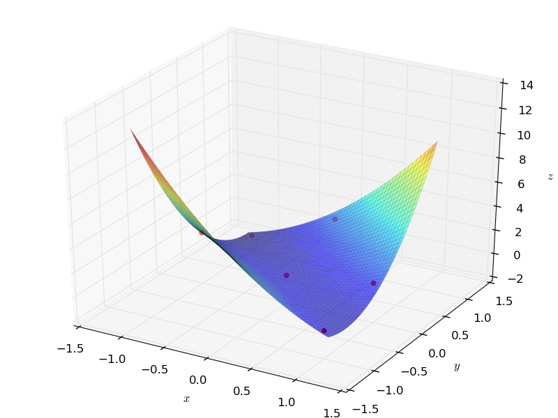
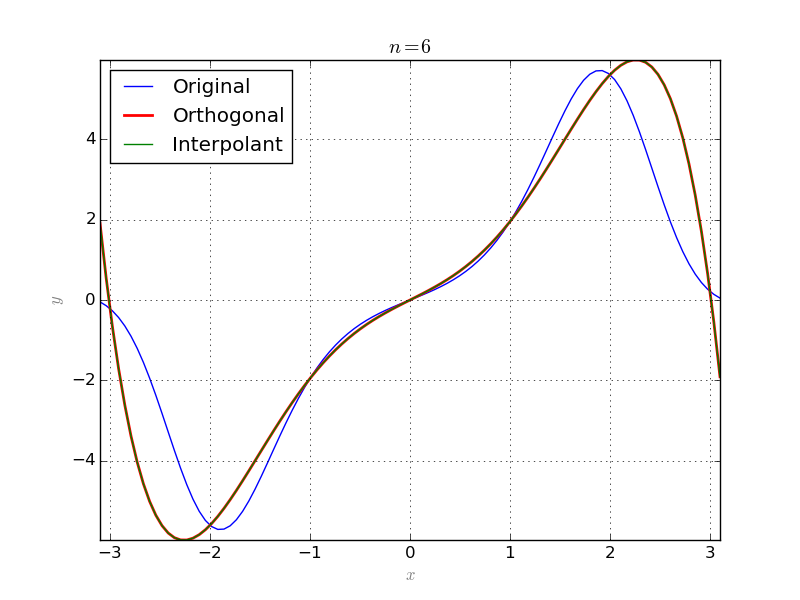

=============================
Interpolation
=============================

Lagrange interpolation
=============================

Suppose that a list of :math:`m+1` points :math:`\{(x_0, y_0),\dots,(x_{m}, y_{m})\}` in :math:`\mathbb{R}^2` is given, such that
:math:`x_i\neq x_j`, if :math:`i\neq j`. Then

.. math::
	p({\bf x}) = \sum_{i=0}^m y_i\ell_i({\bf x}),

is a polynomial of degree `m` which passes through all the given points. Here 

.. math::
	\ell_i({\bf x}) = \prod_{j\neq i}\frac{{\bf x}-x_j}{x_i-x_j},

are *Lagrange Basis Polynomials*.

This procedure can be extended to multivariate case as well.

Suppose that a list of points :math:`\{{x}_1,\dots,{x}_{\rho}\}` in :math:`\mathbb{R}^n` and a list of corresponding 
values :math:`\{y_1,\dots,y_\rho\}` are given. Lets denote by :math:`{\bf X}` the tuple :math:`({\bf X}_1,\dots,{\bf X}_n)` of variables
and :math:`{\bf X}_1^{e_1}\cdots{\bf X}_n^{e_n}` by :math:`{\bf X}^{\bf e}`, where :math:`{\bf e}=(e_1,\dots,e_n)`.

If for some :math:`m>0`, we have :math:`\rho={{m+n}\choose{m}}`, then the number of given points matches the number of monomials of
degree at most `m` in the polynomial basis. Denote the exponents of these monomials by :math:`{\bf e}_i`, :math:`i=1,\dots,\rho` and let

.. math::
	D=\left(\begin{array}{ccc}
		x_1^{{\bf e}_1} & \dots & x_1^{{\bf e}_{\rho}}\\
		\vdots & & \vdots \\
		x_{\rho}^{{\bf e}_1} & \dots & x_{\rho}^{{\bf e}_{\rho}}\\
	\end{array}\right)

and for :math:`1\leq j\leq\rho`:

.. math::
	D_j=\left(\begin{array}{ccc}
		x_1^{{\bf e}_1} & \dots & x_1^{{\bf e}_{\rho}}\\
		\vdots & \vdots & \vdots \\
		x_{j-1}^{{\bf e}_1} & \dots & x_{j-1}^{{\bf e}_{\rho}}\\
		{\bf X}^{{\bf e}_1} & \dots & {\bf X}^{{\bf e}_{\rho}}\\
		x_{j+1}^{{\bf e}_1} & \dots & x_{j+1}^{{\bf e}_{\rho}}\\
		\vdots & \vdots & \vdots \\
		x_{\rho}^{{\bf e}_1} & \dots & x_{\rho}^{{\bf e}_{\rho}}\\
	\end{array}\right).

Then the polynomial

.. math::
	p({\bf X}) = \sum_{i=1}^{\rho} y_i\frac{|D_i|}{|D|},

interpolates the given list of points and their corresponding values. Here :math:`|M|` denotes the determinant of `M`.

The above procedure is implemented in the ``Interpolation`` module. The following code provides an example in 2 dimensional case::

	from sympy import *
	from IntgDiff import Interpolation
	# define symbolic variables
	x = Symbol('x')
	y = Symbol('y')
	# initiate the interpolation instance
	Inter = Interpolation([x, y], 'sympy')
	# list of points
	points = [(-1, 1), (-1, 0), (0, 0), (0, 1), (1, 0), (1, -1)]
	# corresponding values
	values = [-1, 2, 0, 2, 1, 0]
	# interpolate
	p = Inter.Interpolate(points, values)
	# print the result
	print p
	G = Graphics('sympy')
	points3d = [(-1, 1, -1), (-1, 0, 2), (0, 0, 0), (0, 1, 2), (1, 0, 1), (1, -1, 0)]
	G.Point(points3d, color='red')
	G.Plot3D(p, (x, -1.1, 1.1), (y, -1.1, 1.1))

This will be the result:

:math:`L^2`-approximation with discrete measures
==================================================
Suppose that :math:`\mu=\sum_1^n\delta_{x_i}` is a measure with `n`-points in its support. Then the orthogonal system of polynomials consists of at most
`n+1` polynomials. Approximation with these `n+1` polynomials is essencially same as interpolation::

	# symbolic variable
	x = Symbol('x')
	# function to be approximated
	g = sin(x)*exp(sin(x)*x)#x*sin(x)
	# its numerical equivalent
	g_ = lambdify(x, g, 'numpy')
	# number of approximation terms
	n = 6
	# half interval length
	l = 3.1
	# interpolation points and values
	Xs = [[-3], [-2], [-1], [0], [1], [2], [3]]
	Ys = [g_(Xs[i][0]) for i in range(7)]
	# a discrete measure
	supp = {-3:1, -2:1, -1:1, 0:1, 1:1, 2:1, 3:1}
	M = Measure(supp)
	# orthogonal system
	S = OrthSystem([x], [(-l, l)])
	# link the measure
	S.SetMeasure(M)
	# polynomial basis
	B = S.PolyBasis(n)
	# link the basis to the orthogonal system
	S.Basis(B)
	# form the orthonormal basis
	S.FormBasis()
	# calculate coefficients
	cfs = S.Series(g)
	# orthogonal approximation
	aprx = sum([S.OrthBase[i]*cfs[i] for i in range(len(B))])
	# interpolate
	Intrp = Interpolation([x])
	intr = Intrp.Interpolate(Xs, Ys)
	# plot the results
	G = Graphics('sympy', numpoints=100)
	G.SetTitle("$n = %d$"%(n))
	G.Plot2D(g, (x, -l, l), color='blue', legend='Original')
	G.Plot2D(aprx, (x, -l, l), color='red', legend='Orthogonal', thickness=2)
	G.Plot2D(intr, (x, -l, l), color='green', legend='Interpolant')
	G.save('OrthIntrp.png')

